<p align="center">
  
</p>

<h1 align="center">SubSup 订阅归档</h1>

<p align="center">把 SupSub 里的订阅资讯留在手机/平板本地，离线阅读、整理重点，并可选择同步到 Notion。</p>

<p align="center">
  
  
  
</p>

<p align="center">
  <picture>
    <source media="(max-width: 600px)" srcset="docs/screenshots/07-read-list.png">
    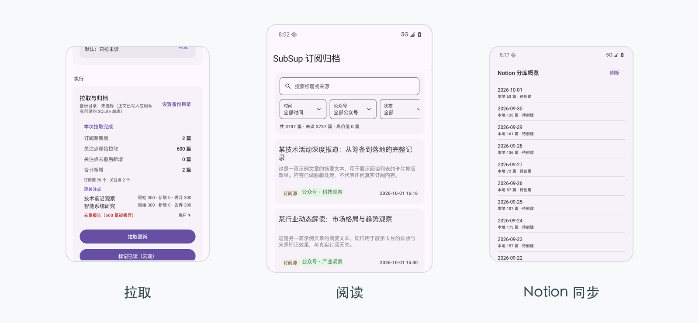
  </picture>
</p>

<p align="center">
  <a href="#快速开始">快速开始</a> · <a href="#界面预览">界面预览</a> · <a href="#自行构建">自行构建</a> · <a href="#赞赏">赞赏</a>
</p>

> 本项目是社区开发的第三方客户端，与 SupSub 官方无隶属关系；接口字段结构参考开源的 [supsub-cli](https://github.com/SupSub-AI/supsub-cli)。

## 关于 SupSub

[SupSub](https://supsub.net/) 是一个订阅资讯聚合服务：在网页端维护自己的订阅源（公众号 / 网站 / X）与关注点，它把新内容汇总成一份持续更新的资讯流。

本 App 是它的移动端归档客户端 —— 不是替代它，而是把内容接回你自己的设备：本地 SQLite 是唯一真相源，阅读状态与标记都留在手里；需要长期知识库时，再挑一个 Notion 容器页做双向同步。

## 它解决什么问题

订阅号越来越多，文章来得比看得快。在手机浏览器里刷一遍，等于什么都不留：过两天想找那篇看过的文章，已经翻不回来了。

这个 App 的做法是：把订阅内容**拉到本地 SQLite**，按关注点聚类成折叠卡片，读过的、高价值的就地打标；想要更长期的知识库，再选一个容器页，按天分库双向同步进 Notion。本地库是唯一真相源，断网也能读。

## 功能一览

| 能力 | 说明 |
|---|---|
| 设备授权登录 | 沿用 supsub CLI 的 OAuth Device Flow，扫码授权，令牌本地保存并自动续期 |
| 拉取与限速 | 只拉未读 / 是否含关注点内容可开关，内置令牌桶限速（2 req/s，突发 3）避免触发服务端限流 |
| 本地全量归档 | 单库 6 张表（文章 / 分库 / 元信息 / 历史 / 评论 / 删除墓碑），离线可读 |
| 阅读与聚类 | 按关注点折叠成卡片集群，时间 / 公众号 / 状态三段筛选，搜索、已读勾选、星标高价值 |
| Notion 双向同步 | 按天分库建页，contentId 防重复建页，已读与高价值字段双向同步 |
| 三方同步 | 手机 / 平板 / Notion 星型拓扑：本地库为准，删除走真同步 + 墓碑，字段级 LWW 合并 |
| 离线可用 | 断网不回登录页，仍可读本地归档、打标；联网操作置灰，网络恢复后自动续上 |
| 平板双栏 | 大屏左右分栏，列表与详情并排，分割条比例可拖可记忆 |
| 一键备份 | 导出整个 `.db` 备份文件到你选定的目录 |

## 界面预览

<p align="center">
  <a href="docs/screenshots/05-archive-backup.png">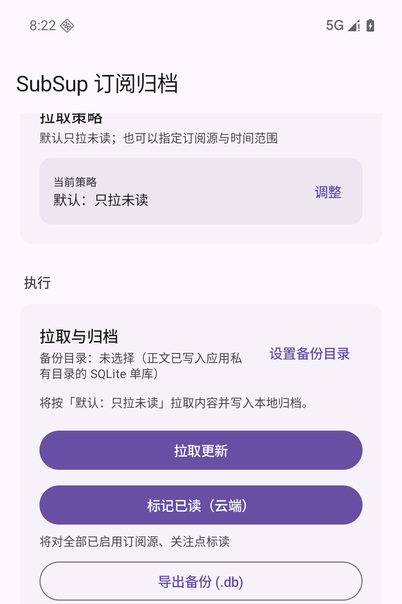</a>
  <a href="docs/screenshots/08-read-detail.png">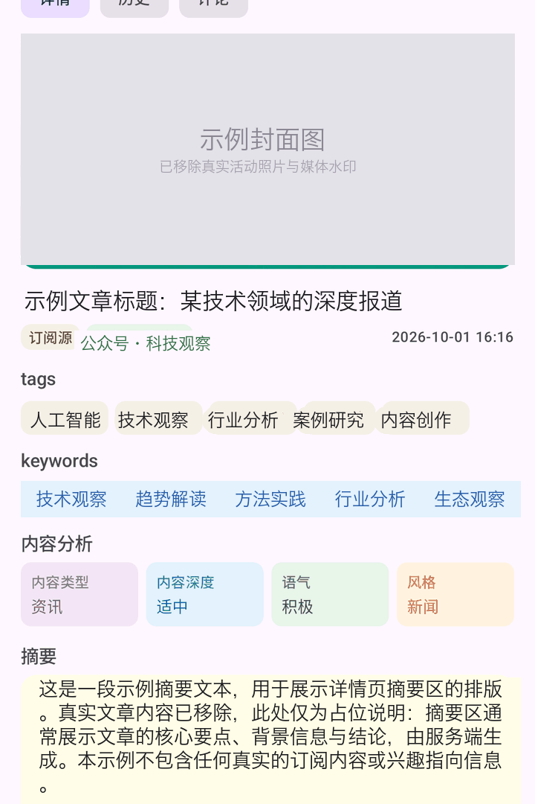</a>
  <a href="docs/screenshots/10-notion-config.png">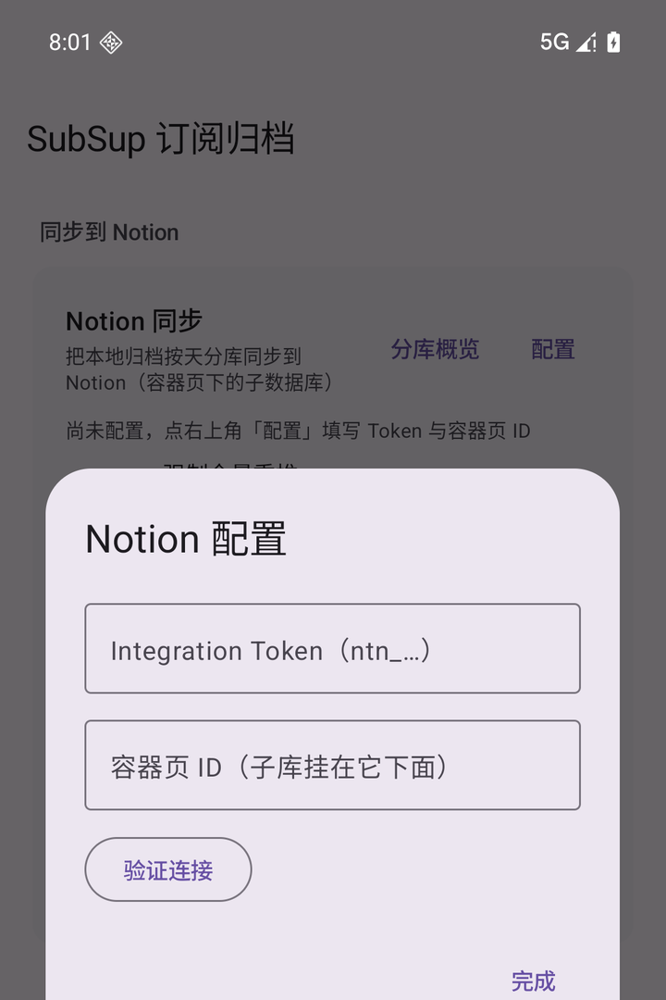</a>
  <a href="docs/screenshots/15-tablet-dual-pane.png">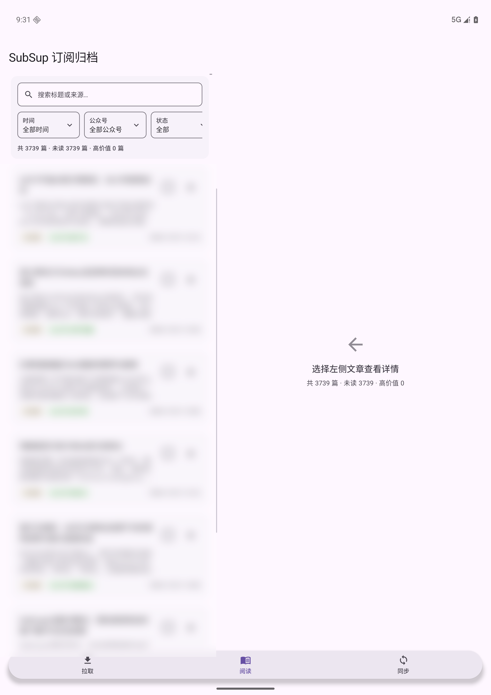</a>
</p>

<p align="center"><sub>拉取与备份 · 阅读详情 · Notion 配置 · 平板双栏</sub></p>

平板宽屏下自动切换为左右双栏，手机保持单栏阅读。平板截图的左栏内容已柔化处理。

<details>
<summary>查看更多界面截图</summary>

<table align="center">
  <tr><th>账号与归档</th><th>内容来源</th><th>拉取策略</th></tr>
  <tr>
    <td>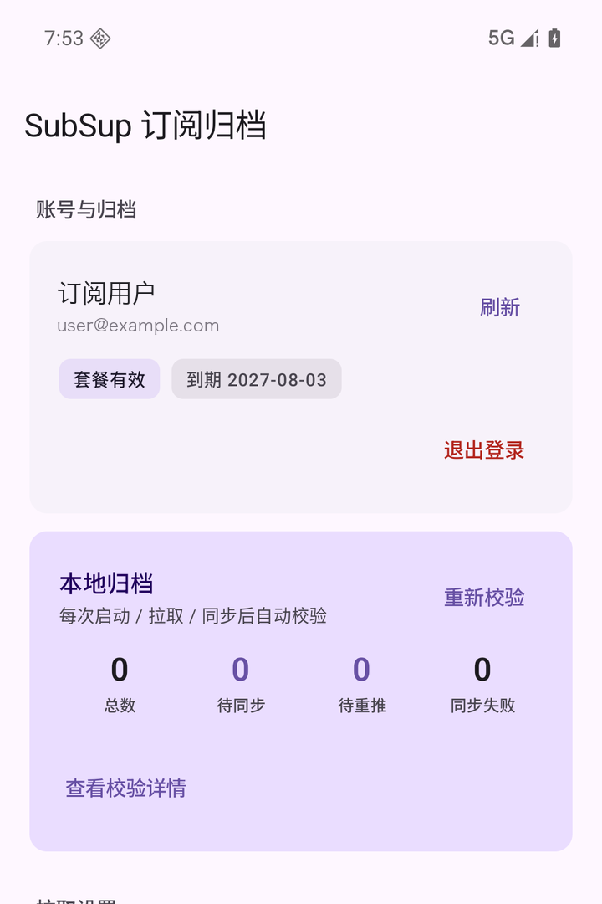</td>
    <td>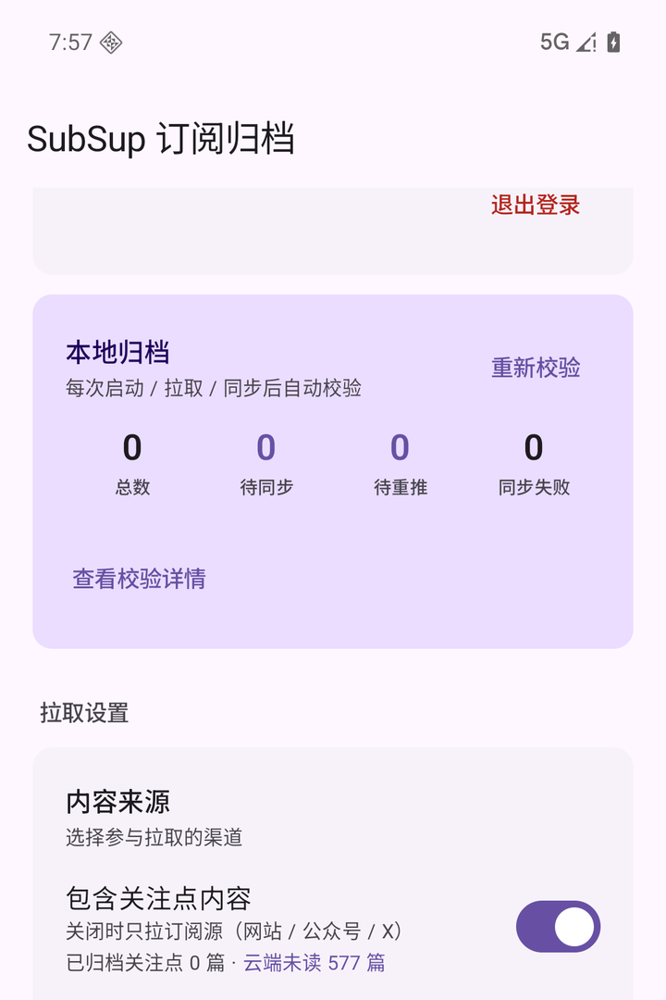</td>
    <td>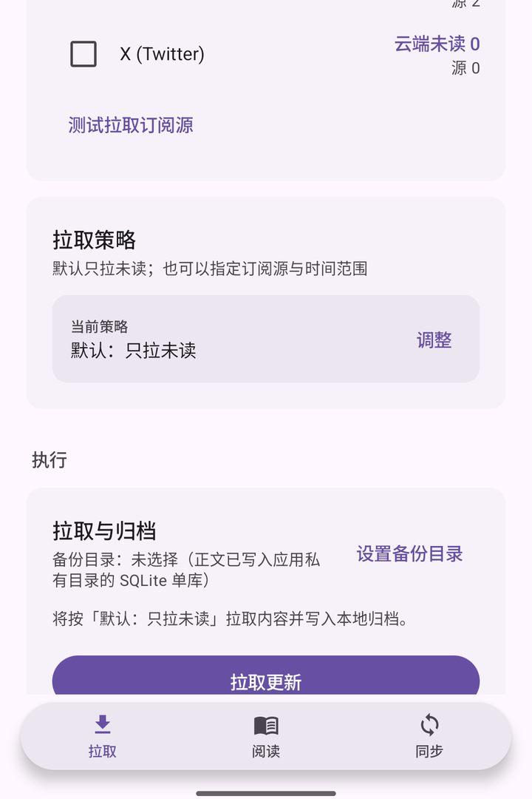</td>
  </tr>
</table>

<table align="center">
  <tr><th>拉取完成</th><th>归档分布</th><th>阅读列表</th></tr>
  <tr>
    <td>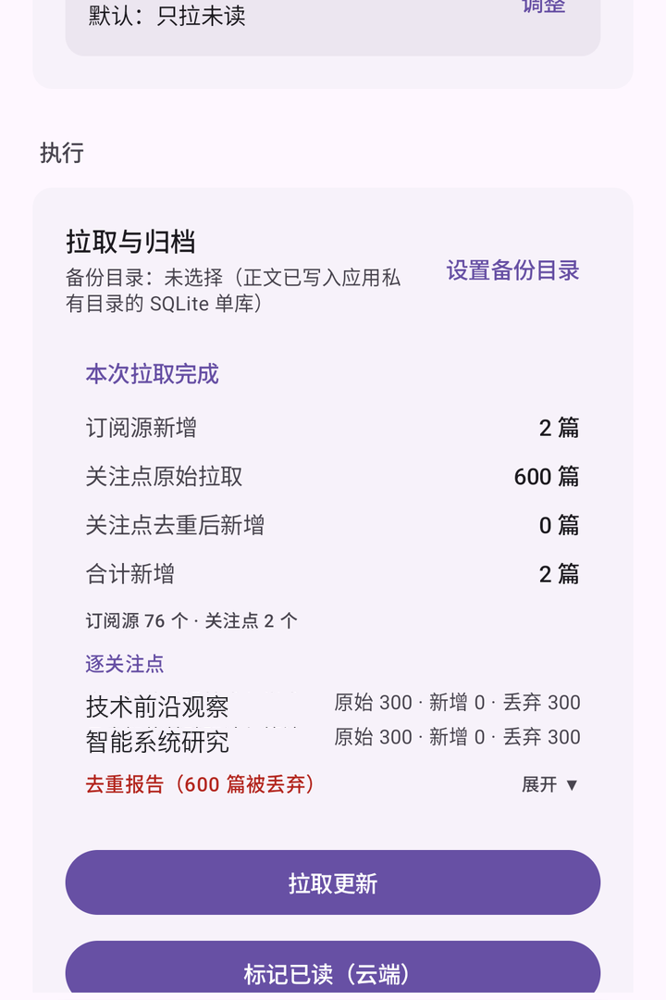</td>
    <td>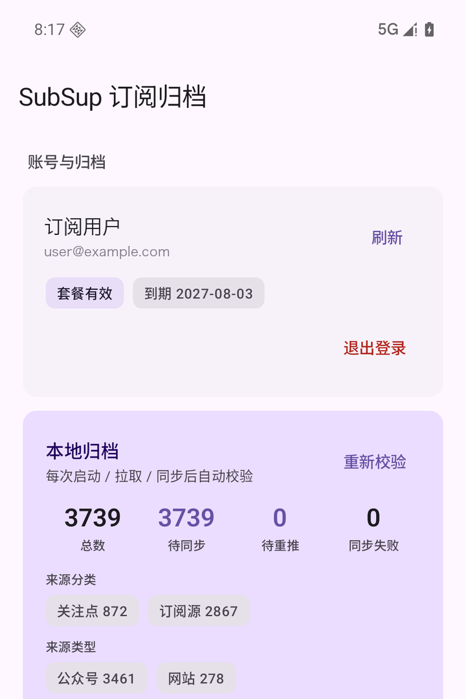</td>
    <td>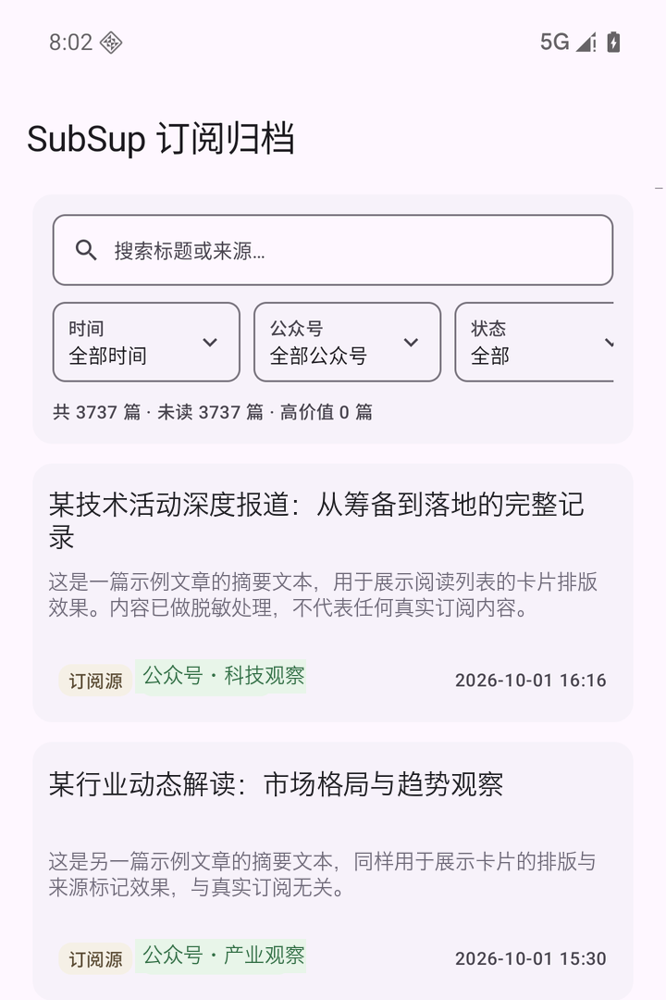</td>
  </tr>
</table>

<table align="center">
  <tr><th>来源筛选</th><th>Notion 分库</th><th>离线阅读</th></tr>
  <tr>
    <td>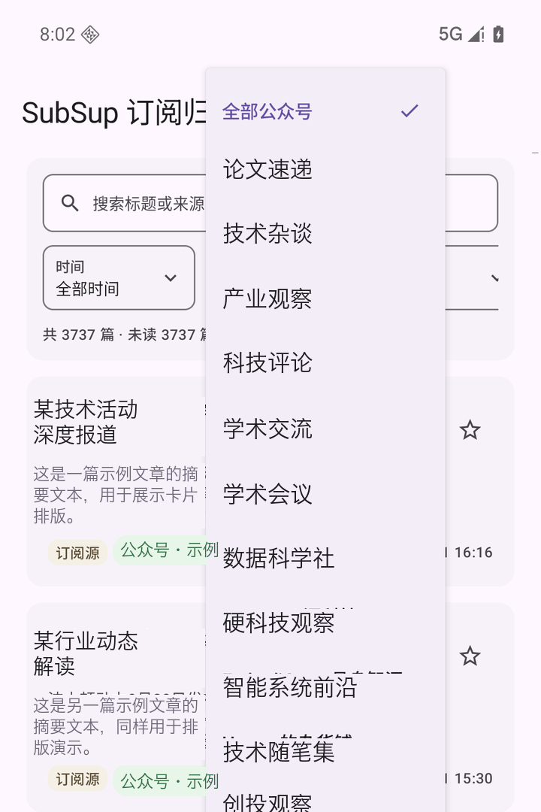</td>
    <td>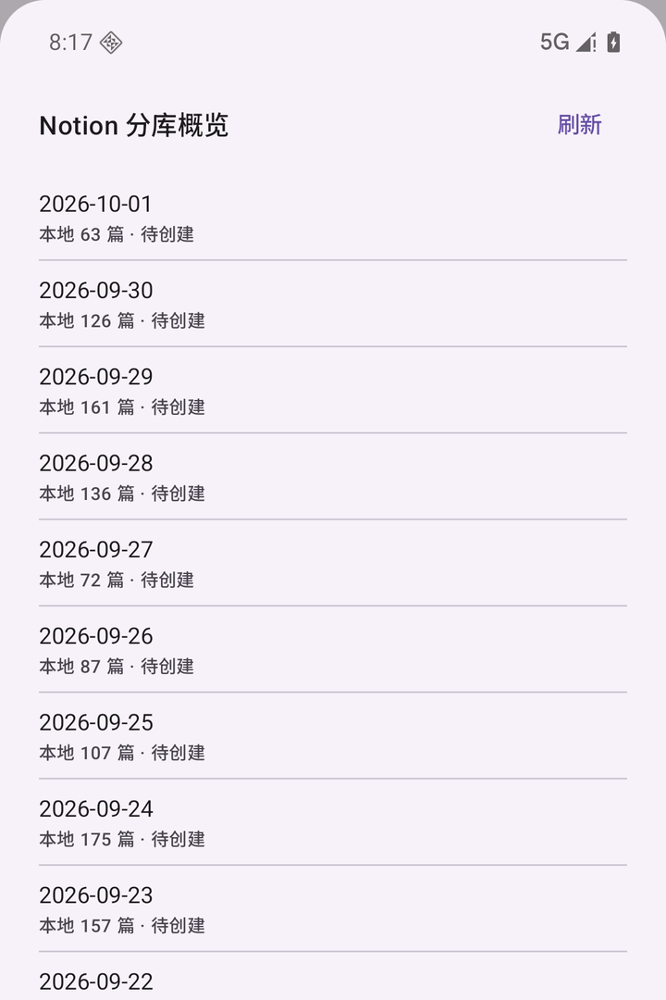</td>
    <td>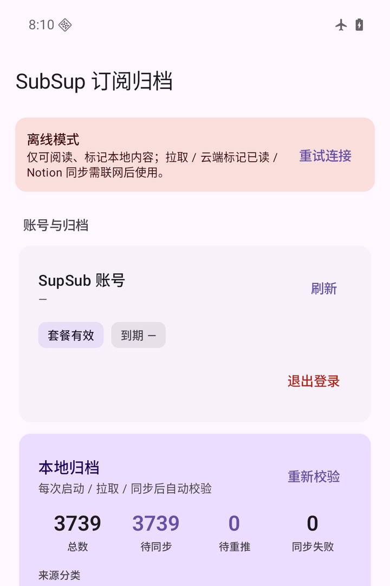</td>
  </tr>
</table>

</details>

## 快速开始

1. **装**：按下方「自行构建」生成 APK，安装到 Android 10 及以上设备，打开后完成 SupSub 设备授权。
2. **配**（可选，不需要 Notion 也可以只用本地归档）：在「Notion 同步」里填入自己的 Integration Token 与容器页 ID，点右上角「配置」可随时改。
3. **拉**：回到「拉取」页按下「拉取更新」，等归档完成即可在阅读页翻。

> 登录采用设备授权流：App 展示短码并拉起授权页，你确认后它轮询换取令牌（accessToken 约 24h、refreshToken 约 14d，到期前自动续期）。

| 登录 | 设备授权短码 |
| :---: | :---: |
| 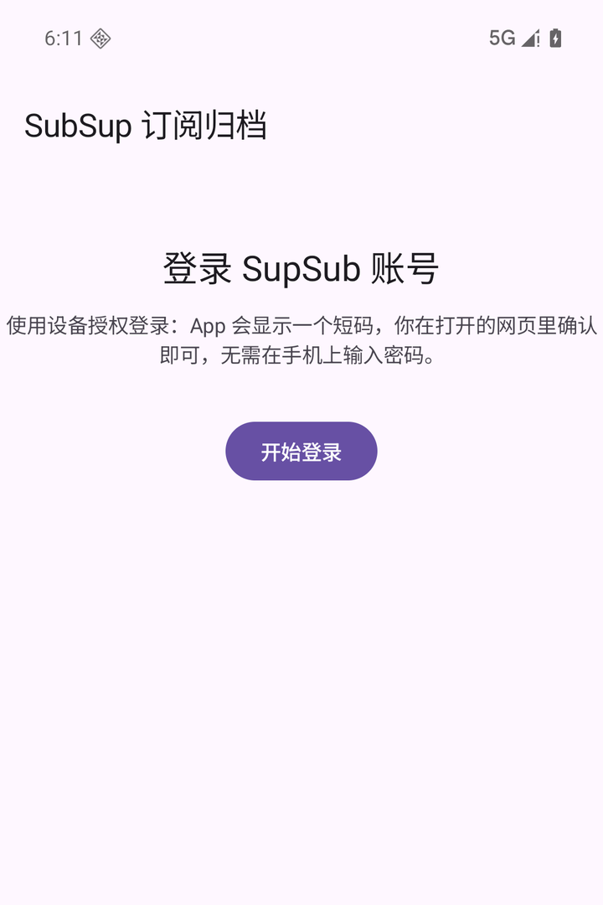<br><br>打开即提示授权方式，点「开始登录」生成短码 | 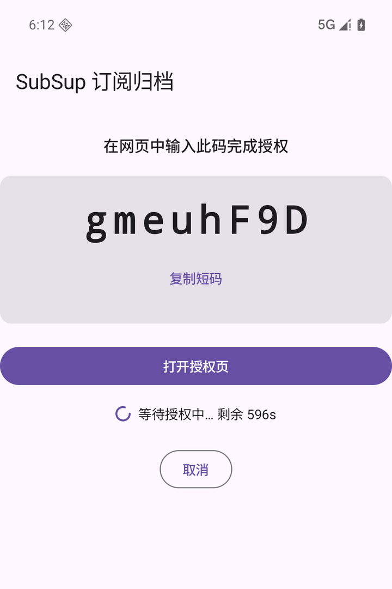<br><br>短码 + 「打开授权页」，网页里确认后 App 自动完成登录 |

> 「整源标记已读」是不可逆操作，App 会二次确认；点之前想清楚。

## 自行构建

环境：JDK 17、Android SDK（compileSdk 35 / minSdk 29）、AGP 8.5.2、Kotlin 2.0.20、Gradle 8.9。

```bash
cd android
./gradlew assembleDebug
# 产物：app/build/outputs/apk/debug/app-debug.apk

$ANDROID_HOME/platform-tools/adb install -r app/build/outputs/apk/debug/app-debug.apk
```

> 上述产物是开发调试构建，不作为公开分发版本。

端点的字段结构取自开源 [supsub-cli](https://github.com/SupSub-AI/supsub-cli)（MIT，`master` 分支），非官方开放文档。解析层因此做了两处容错：未知字段不报错，`publishedAt` 的整数时间戳与字符串两种形态都能归一为同一时间。

## 项目结构

```
SubSup/
├── app/               界面与导航（Compose）
│   └── …/notion/      入口 MainActivity + ui/（Tab 与卡片组件）+ vm/（AuthViewModel）
├── feature-supsub/    SupSub REST 客户端、设备授权、令牌管理、拉取引擎
├── feature-notion/    Notion 客户端、Schema、分库路由、同步引擎
├── core-data/         本地存储层（ArchiveDb / ArchiveStore / 聚类引擎）
├── docs/              架构说明、排障笔记、界面截图、赞赏码
└── README.md  CHANGELOG.md  LICENSE  CONTRIBUTING.md
```

## 架构简析

数据流是**手机 / 平板 → 本地 SQLite → Notion** 的星型拓扑，设备之间不直连：本地库是唯一真相源，Notion 只是远端镜像。

- 拉取：SupSub API → 令牌桶限速 → 本地 `articles` 表，URL / 内容双重判重
- 同步：**先拉后推**；`contentId` 隐藏列防重复建页；删除走墓碑，不静默丢数据
- 冲突：同字段后写者胜（LWW），脏标记列驱动增量推送，多轮同步能收敛
- 离线：本地有令牌就进入离线态保留阅读，联网操作全部前置护栏

细节见 [docs/architecture.md](docs/architecture.md)，排障见 [docs/troubleshooting.md](docs/troubleshooting.md)。

## 常见问题

**需要 SupSub 账号吗？** 需要，走设备授权扫码登录。令牌默认在本机加密存储；设备加密存储不可用时，App 会提示并回退到普通本地存储。

**会消耗我的 SupSub 额度吗？** 会。接口只返回摘要，深读正文会消耗不可逆的月度额度，所以默认「只拉未读 + 摘要」，全文留给手动精读。

**必须配 Notion 吗？** 不必须。不填也能本地归档、离线阅读、打标；Notion 只是可选的第二步。

**会删掉我 Notion 里的数据吗？** 只删本 App 同步过的条目，且是真同步删 + 墓碑留痕；你在 Notion 里手建、未在 App 中出现的页面不会被触碰。

**换手机或重装会丢归档吗？** 会丢本地库。用主界面的「导出备份 (.db)」把整库导出到你选定的目录自行留存。

## 免责声明

本项目**非 SupSub 与 Notion 官方出品**，SupSub、Notion 均为各自公司的商标。同步行为依赖两家平台的接口，API 变更可能导致功能失效，属预期内风险。请自行判断「整源标记已读」这类不可逆操作的后果。

## 赞赏

代码开源、免费、无内购。如果它帮你省下了每天翻订阅的时间，欢迎赞赏。

<a href="docs/donate/reward.png">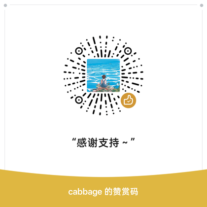</a>

## 许可

[MIT](LICENSE) © 2026 caipeide

参与贡献前请读 [CONTRIBUTING.md](CONTRIBUTING.md) 与 [CODE_OF_CONDUCT.md](CODE_OF_CONDUCT.md)；安全问题请走 [SECURITY.md](SECURITY.md) 的私密通道反馈。
